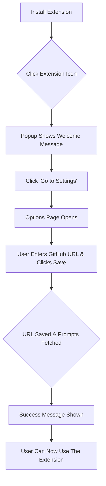
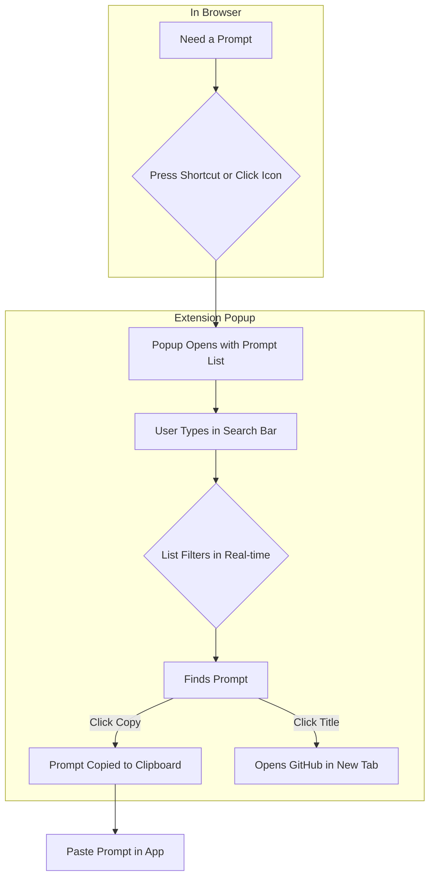
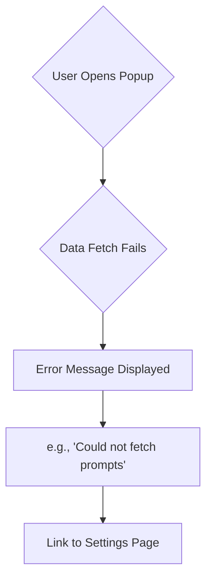

# User Flow Documentation

This document outlines the key user journeys for the extension, from initial setup to core daily use.

## 1. First-Time Setup & Onboarding

This flow describes a new user's first interaction with the extension.

## 2. Core User Journey

This flow describes the primary, day-to-day workflow for a configured user.

## 3. Error Flow

This flow describes what happens when data fetching fails.

